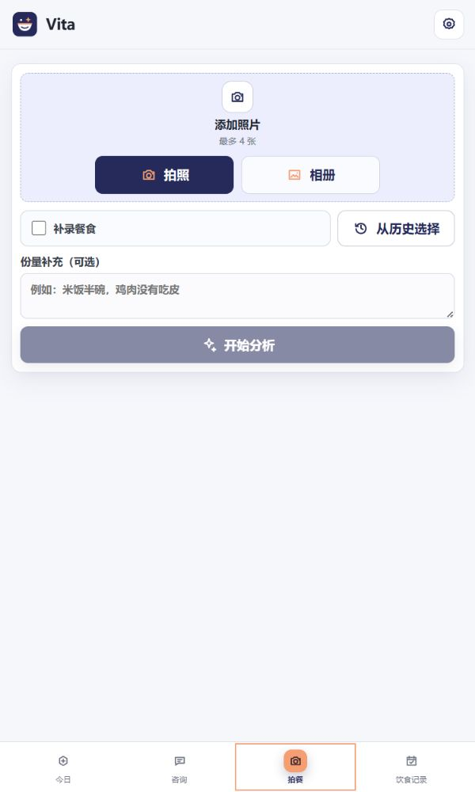
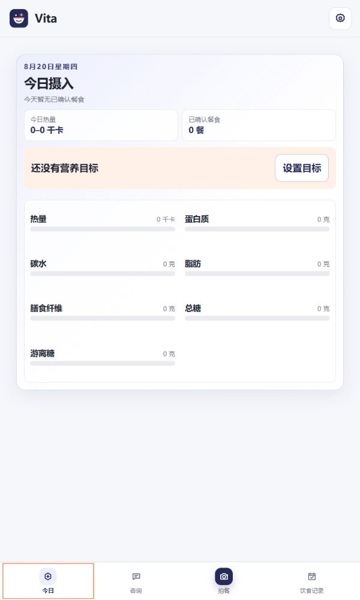
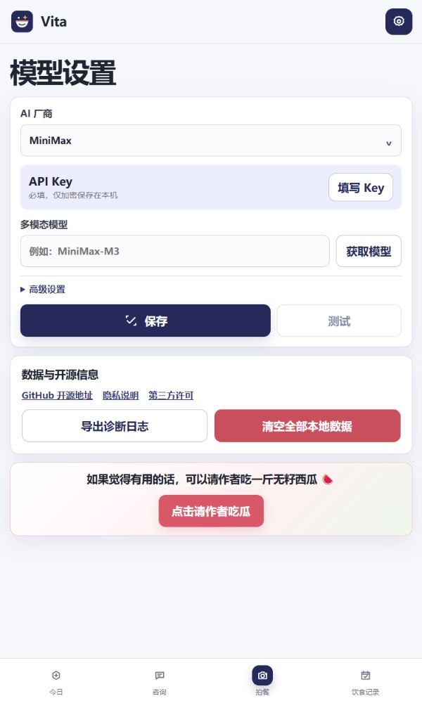

# Vita

Vita 是一款本地优先的 Android 营养助手。拍下餐食，使用你自己的多模态模型 API 完成识别，并在本机管理营养记录、目标与咨询。

## 主要功能

- **拍照识别餐食**：支持拍照或从相册选择多张图片，识别后可调整份量、餐次与食物明细，再确认入库。
- **营养进度**：查看每日热量、蛋白质、碳水、脂肪、膳食纤维和糖摄入范围。
- **饮食记录**：通过月历回顾餐食，也可复用历史餐食或补录最近记录。
- **营养咨询**：结合已确认的本地记录与模型对话，回答内容使用安全 Markdown 渲染。
- **本地目标**：为符合条件的一般健康成人在本机计算营养目标，身体资料不会发送给模型。
- **诊断日志**：遇到问题时可从设置页主动导出脱敏日志，日志不会自动上传。
- **自带模型**：内置阿里云百炼、腾讯混元、智谱 GLM、火山方舟/豆包、MiniMax、硅基流动等预设，也支持自定义兼容接口。

## 应用预览

以下为当前界面预览，不包含真实用户信息。

<table>
  <tr>
    <th width="33%">拍照记录</th>
    <th width="33%">今日摄入</th>
    <th width="33%">模型设置</th>
  </tr>
  <tr>
    <td></td>
    <td></td>
    <td></td>
  </tr>
  <tr>
    <td>拍照、相册、历史复用与补录</td>
    <td>每日营养进度与目标设置</td>
    <td>模型配置、诊断日志与开源信息</td>
  </tr>
</table>

## 隐私与安全

- 无账号、无遥测，模型请求直接发送到用户配置的厂商。
- API Key、本地数据库和缩略图均加密保存，设置页可清空全部本地数据。
- 图片上传前会在本机移除 EXIF/GPS、处理方向并重新编码；原图不会写入 Vita 数据库。
- 自定义接口仅允许 HTTPS 公网地址。详细边界见 [PRIVACY.md](PRIVACY.md) 和 [SECURITY.md](SECURITY.md)。

> Vita 不是医疗设备，不提供诊断或治疗建议。营养目标仅面向符合应用筛查条件的一般健康成人。

## 模型接口

Vita 支持 OpenAI-compatible 与 Anthropic Messages 协议。模型必须具备图片理解能力；自定义接口无法确认能力时，应用会在测试或餐食识别阶段给出明确提示。

## 开发

需要 Node.js 22+、JDK 21 和 Android SDK 36。

```powershell
npm ci
npm test
npm run lint
npm run android:build
```

调试 APK 位于 `android/app/build/outputs/apk/debug/app-debug.apk`。

## 参与项目

提交问题前请阅读 [CONTRIBUTING.md](CONTRIBUTING.md)。安全问题请按 [SECURITY.md](SECURITY.md) 中的方式报告。

## 许可证

项目自有部分以 [Apache-2.0](LICENSE) 发布。第三方组件的许可证见 [THIRD_PARTY_NOTICES.md](THIRD_PARTY_NOTICES.md)。

## 支持 Vita

如果觉得有用的话，可以请作者吃一斤无籽西瓜 🍉

<p align="center"><a href="https://afdian.com/a/lztpho"><strong>点击请作者吃瓜</strong></a></p>
