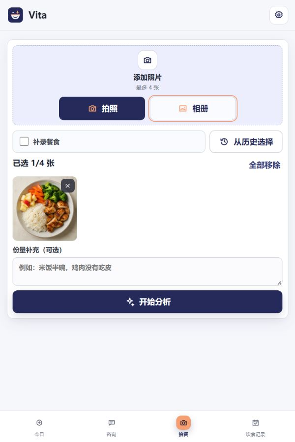
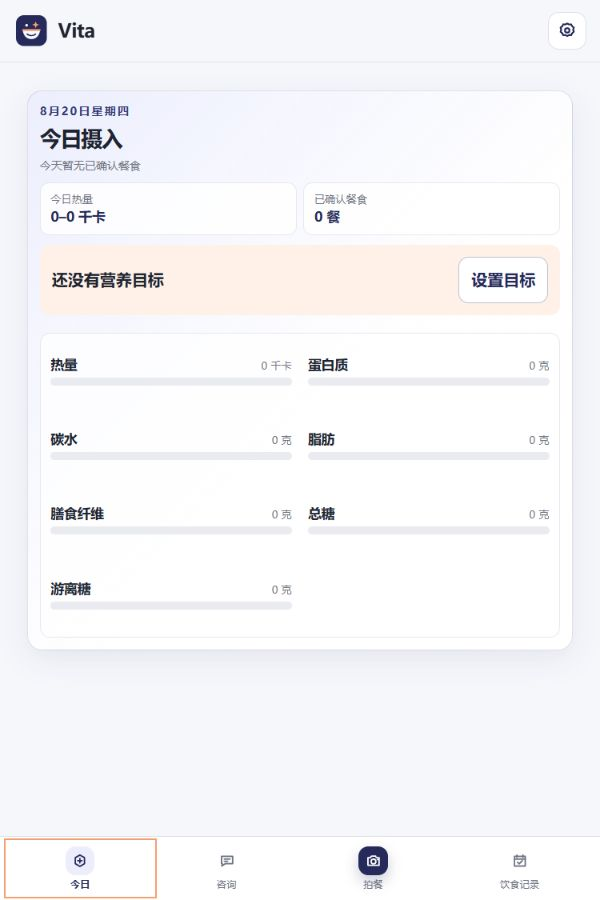
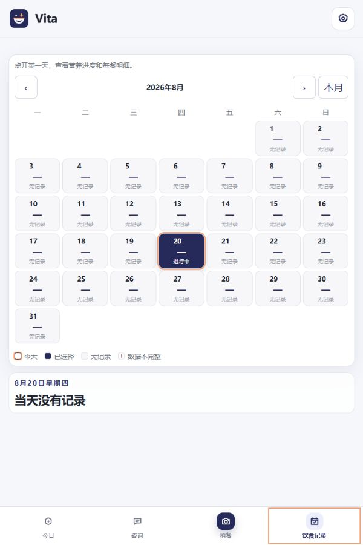
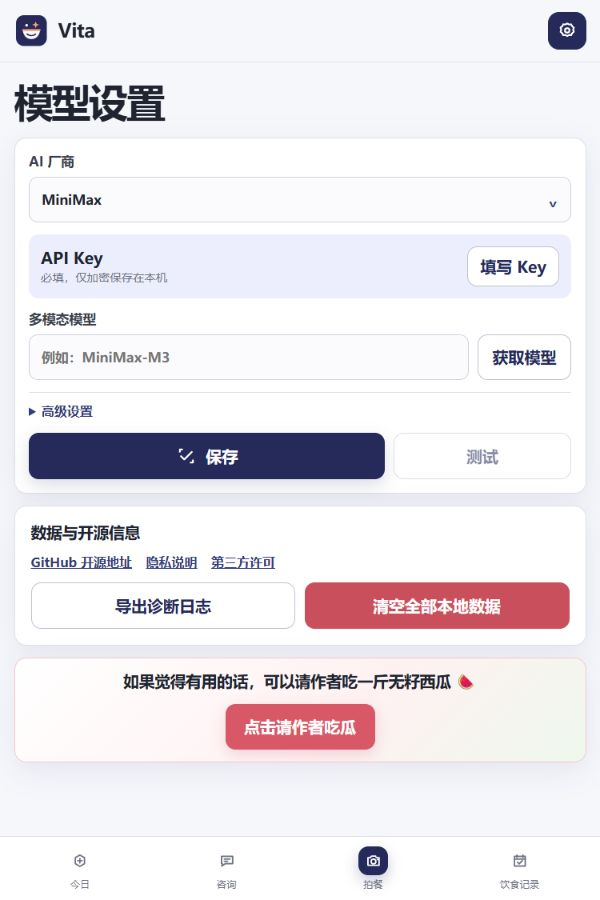

<div align="center">

# Vita

**拍一张，记一餐。**<br>
使用自己的多模态模型，完成餐食识别、营养记录与饮食咨询。

[](https://github.com/lztpho/Vita/releases/latest)
[](https://github.com/lztpho/Vita/releases/latest)
[](LICENSE)

[**下载最新版 APK**](https://github.com/lztpho/Vita/releases/latest) · [反馈问题](https://github.com/lztpho/Vita/issues) · [隐私说明](PRIVACY.md)

</div>

## 能做什么

| | |
|---|---|
| **📷 拍餐识别**<br>拍照或选择相册图片，识别食物、份量与营养范围。 | **📊 今日摄入**<br>查看热量和主要营养素的每日进度。 |
| **📅 饮食记录**<br>按日历回顾、补录或复用历史餐食。 | **💬 饮食咨询**<br>结合已确认的记录，与模型讨论饮食问题。 |

支持 MiniMax、阿里云百炼、腾讯混元、智谱 GLM、火山方舟/豆包、硅基流动等模型预设，也可填写兼容接口。

## 界面预览

### 拍餐识别

拍照、相册与历史复用，识别前可以补充实际份量。

<p align="center"></p>

### 今日摄入

集中查看热量和主要营养素的当天进度。

<p align="center"></p>

### 饮食记录

按日历回顾已经确认的餐食。

<p align="center"></p>

### 模型设置

配置模型、导出日志或管理本地数据。

<p align="center"></p>

> 截图使用虚构演示内容，不包含真实用户信息。

## 开始使用

1. 从 [Releases](https://github.com/lztpho/Vita/releases/latest) 下载并安装 APK。
2. 在设置页选择模型厂商，填写 API Key 和支持图片理解的模型。
3. 拍照或选择餐食图片，确认识别结果后保存。

Vita 不提供内置模型额度，模型请求产生的费用由所选厂商收取。

## 隐私

- 无账号、无遥测；请求只发送给你配置的模型厂商。
- API Key、本地数据库和缩略图加密保存，餐食图片上传前会移除 EXIF/GPS。
- 自定义接口仅允许 HTTPS 公网地址，全部本地数据可随时清空。

更多说明见 [PRIVACY.md](PRIVACY.md) 和 [SECURITY.md](SECURITY.md)。

> Vita 不是医疗设备，识别结果和营养建议仅供参考。

<details>
<summary><strong>开发与构建</strong></summary>

需要 Node.js 22+、JDK 21 和 Android SDK 36。

```powershell
npm ci
npm test
npm run lint
npm run android:build
```

参与贡献前请阅读 [CONTRIBUTING.md](CONTRIBUTING.md)，第三方组件许可见 [THIRD_PARTY_NOTICES.md](THIRD_PARTY_NOTICES.md)。项目以 [Apache-2.0](LICENSE) 发布。

</details>

---

<div align="center">

如果觉得有用的话，可以请作者吃一斤无籽西瓜 🍉

<a href="https://afdian.com/a/lztpho"></a>

</div>
